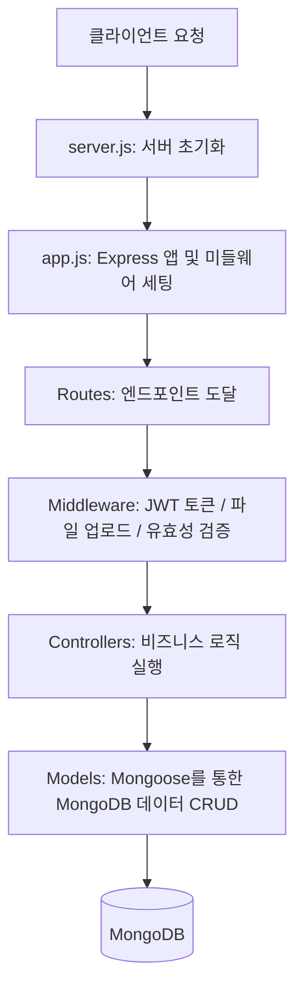

# 🌐 경성대학교 글로컬 컬쳐 허브 (KSU Culture Hub)

## 📌 1. 프로젝트 개요 및 기술 스택
**KSU Culture Hub**는 경성대학교 재학생, 교직원, 그리고 글로벌(Glocal) 커뮤니티를 연결하여 문화 교류, 학생 전용 혜택, 이벤트 신청 및 커뮤니티 자유 게시판을  제공하는 서비스입니다.

### 🛠️ 핵심 기술 스택
*   **런타임 환경**: Node.js (v20 LTS 기반)
*   **웹 프레임워크**: Express.js v4 (보안을 위한 `helmet`, `cors`, 로깅을 위한 `morgan` 포함)
*   **데이터베이스**: MongoDB & Mongoose ODM (Object Document Mapper)
*   **보안 및 인증**: JWT (Json Web Token) + `bcryptjs` 비밀번호 해싱
*   **파일 처리**: Multer 라이브러리 (아바타/이미지 폴더 분리형 자동 저장 기능 제공)
*   **API 문서 자동화**: Swagger OpenAPI 3.0 (`swagger-ui-express` 및 JSDoc 기반 자동 문서화)
*   **유효성 검증**: `express-validator` (요청 데이터 형식 및 이메일 검증)

## ⚡ 2. 핵심 아키텍처 및 흐름

어플리케이션은 **Express의 전형적인 MVC(Model-View-Controller) 패턴**의 구조를 따르고 있으며, 데이터 흐름은 다음과 같습니다.



### 1) 진입점 (Bootstrapping)
*   **`server.js`**: `app.js`에서 작성된 Express 인스턴스를 가져와 데이터베이스(`connectDB`)를 연결한 후 지정된 포트(기본 5000번)로 웹 서버를 가동합니다.
*   **`app.js`**:
    *   보안 관련 헤더 제어(`helmet`), 외부 도메인 접근 허용(`cors`), 파일 용량 제한 파싱(`express.json`)과 정적 파일 디렉터리 바인딩(`uploads/` 폴더 제공) 설정을 합니다.
    *   `/api/auth`, `/api/users` 등의 접두사와 매칭되는 라우터들을 연동합니다.
    *   **전역 에러 핸들러 미들웨어**(`errorHandler`)를 가장 하단에 배치하여 서비스 운영 중 예측하지 못한 시스템/스키마 오류를 일관되게 JSON 형태로 클라이언트에 반환합니다.

---

## 🔍 3. 주요 구성 요소별 상세 분석

### 🔐 1) 인증 및 보안 (Authentication & RBAC)
프로젝트는 견고한 **이중 토큰(Access Token & Refresh Token) 인증 구조**를 취하고 있습니다.

*   **학교 이메일 도메인 검증 (`auth.controller.js`)**:
    ```javascript
    const isAllowedEmail = (email) => {
      const domains = (process.env.ALLOWED_EMAIL_DOMAINS || 'ks.ac.kr').split(',');
      return domains.some((d) => email.toLowerCase().endsWith(`@${d.trim()}`));
    };
    ```
    *   경성대학교 전용 도메인(`@ks.ac.kr`)으로 가입한 학생 또는 교직원만 사이트를 사용할 수 있도록 회원가입 단계에서 도메인을 필터링합니다.
*   **역할 기반 제어 - RBAC (`middleware/auth.js`)**:
    *   역할은 `student`(재학생), `staff`(교직원), `admin`(관리자)의 3단계로 구분됩니다.
    *   `protect` 미들웨어를 통해 JWT 유효성과 계정의 활성화 상태(`isActive`)를 판단합니다.
    *   `authorize('admin')`처럼 가변 인자 구조의 미들웨어를 제공하여 특정 엔드포인트를 관리자 또는 교직원 등 특정 계정만 사용할 수 있도록 제한합니다.
*   **비밀번호 보호 (`models/User.js`)**:
    *   가입/수정 시 `pre('save')` 훅을 사용해 `bcryptjs`로 12라운드 솔팅(Salting) 후 안전하게 암호화하여 저장합니다.
    *   사용자 정보 조회 시 비밀번호 유출을 기본적으로 차단하기 위해 스키마에 `select: false` 속성이 적용되어 있습니다.
    *   JSON 변환 메서드(`toJSON`)를 재정의하여 직렬화 시 암호화 비밀번호와 `refreshToken`을 자동으로 삭제 후 응답합니다.

### 📂 2) 업로드 파이프라인 (Multer Middleware)
*   **`middleware/upload.js`**:
    *   파일 크기를 환경 변수(`MAX_FILE_SIZE_MB`, 기본 10MB) 기준으로 제어합니다.
    *   업로드 시 파일 필드 이름(`avatar` 인가 또는 그 외 이미지 필드 인가)에 따라 내부적으로 `uploads/avatars/`와 `uploads/images/`로 폴더를 자동으로 생성하고 격리하여 파일을 분리 관리합니다.
    *   허용되는 확장자(`jpeg`, `jpg`, `png`, `gif`, `webp`)가 아닌 경우 에러를 반환하는 `fileFilter` 보안 가드가 존재합니다.

### 🌐 3) API 자동 문서화 (Swagger)
*   **`config/swagger.js`**:
    *   프로젝트 전반에 걸쳐 라우터 파일 상단에 작성된 JSDoc 스타일의 주석(`@swagger`)을 파싱하여 대시보드 화면을 렌더링합니다.
    *   로컬이나 개발 서버에서 `/api-docs` 주소로 접속하면 프론트엔드 개발자가 즉시 연동 테스트를 해볼 수 있는 Swagger UI가 제공됩니다.

### 🗃️ 4) 데이터 모델 스키마 디자인 (Mongoose Models)
*   **`User.js` (사용자)**: 회원 기본 정보 외에도 획득한 혜택 목록(`claimedBenefits`), 신청한 문화 이벤트 리스트(`appliedEvents`) 등을 ObjectId 참조 형식으로 긴밀하게 연관시킵니다.
*   **`Event.js` (이벤트)**: 행사 장소, 인원 제한, 마감 일자 등을 기록합니다.
    *   **가상 필드(Virtuals)**: Mongoose의 가상 속성을 활용해 실시간으로 `남은 정원 = capacity - applicants.length` 계산 결과를 DB 용량 추가 없이 API 응답 시 가상 계산 필드로 함께 반환하도록 설계되어 성능에 최적화되어 있습니다.
*   **`Benefit.js` (혜택)**, **`Post.js` (게시판 게시글)**, **`Partner.js` (파트너 제휴사)** 등 글로컬 교류 플랫폼에 알맞은 관계형 데이터가 촘촘히 엮여 있습니다.

---

## 🛠️ 4. 프로젝트 로컬 실행 및 확인 방법
백엔드를 가동하고 테스트하기 위한 명령어와 절차입니다.

### 1) 환경 변수 설정
`server/.env` 파일을 아래 구조를 모방하여 생성합니다. (또는 `.env.example`을 참고)
```ini
PORT=5000
NODE_ENV=development
MONGODB_URI=mongodb://localhost:27017/ksu_culture
JWT_SECRET=your_super_secret_access_key
JWT_REFRESH_SECRET=your_super_secret_refresh_key
ALLOWED_EMAIL_DOMAINS=ks.ac.kr
MAX_FILE_SIZE_MB=10
```

### 2) 의존성 설치 및 구동
```bash
# 1. server 디렉터리로 이동
cd server

# 2. 패키지 설치
npm install

# 3. nodemon 개발 모드로 기동
npm run dev
```

### 3) 헬스체크 및 문서 확인
*   **서버 상태 체크 API**: `GET http://localhost:5000/api/health`
*   **Swagger API 문서 주소**: `http://localhost:5000/api-docs`

---

## 💡 분석 요약 및 향후 유지보수 추천 포인트
1.  **높은 모듈성**: 라우터, 컨트롤러, 모델, 미들웨어가 완벽히 쪼개져 있어 새로운 도메인(예: 채팅, 포인트 샵 등)을 확장하기에 최고의 기반을 가지고 있습니다.
2.  **안전성**: 전역 예러 핸들러와 이메일 및 유효성 가드(`express-validator`)가 이중으로 잡혀 있어 튼튼합니다.
3.  **성능 팁**: `Event.js`의 가상 정원 계산 방식은 실시간으로 연동되나, 동시 다발적인 대규모 수강 신청 시 동시성 이슈(정원 초과 문제)를 예방하기 위해, 추후 **원자적 연동(Mongoose `$push` 조건부 업데이트)**을 정비하면 한 단계 더 우아한 코드가 완성될 것입니다!
